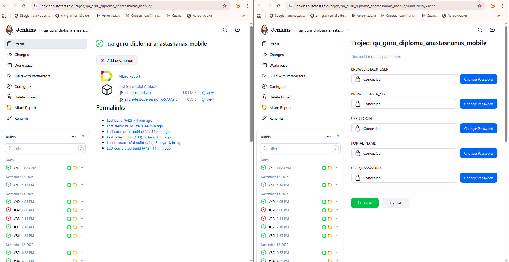
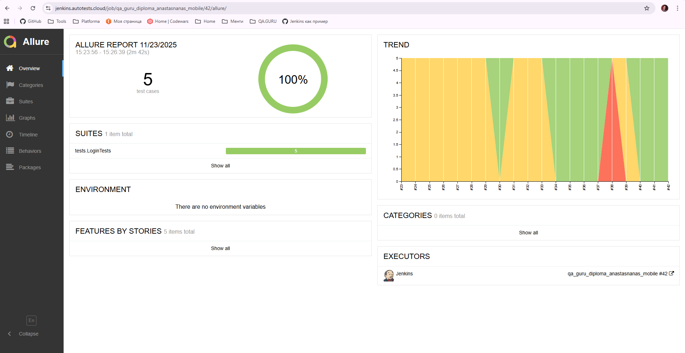
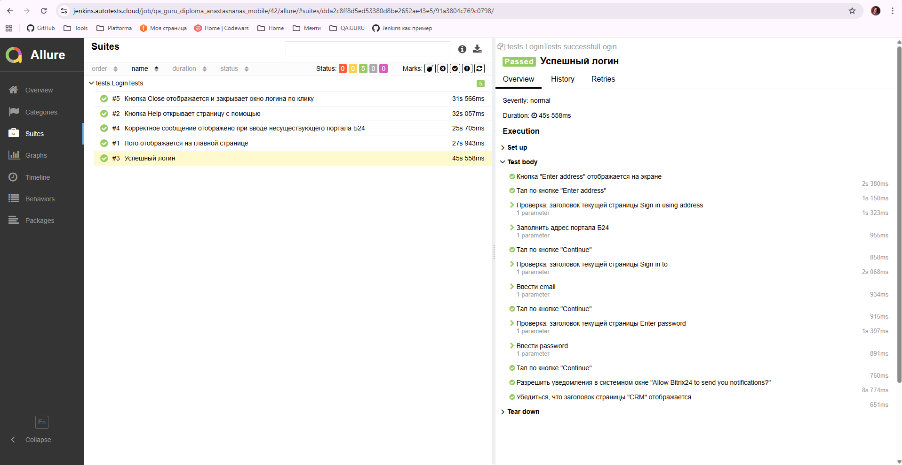
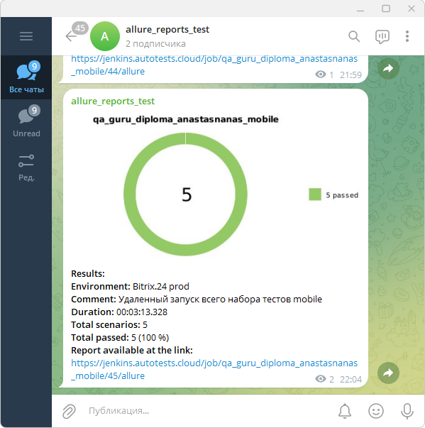

# Дипломная работа по автоматизации тестирования портала Битрикс.24 - мобильное приложение
<div align="center"> </div>
<br>
<div style="border-left: 4px solid #ccc; padding-left: 16px; margin: 20px 0; color: #333; font-size: 16px;">
  <strong>💡 Что такое Битрикс.24?</strong><br>
  Битрикс24 — это комплексная облачная платформа, объединяющая в одном рабочем пространстве CRM, задачи, документы, чаты, звонки, видеоконференции и автоматизацию бизнес-процессов.
</div>
<br>
<div style="border-left: 4px solid #ccc; padding-left: 16px; margin: 20px 0; color: #333; font-size: 16px;">
<strong> 🌿 Почему Битрикс.24 был выбран для дипломного проекта? </strong><br>
На своей практике я видела, что не все компании используют CRM в таком виде, в котором его продает вендор. И конечно, любая доработка может сломать что-либо, снижается стабильность сайта. Автотесты помогут раньше обнаруживать ошибки и снизить нагрузку на ручных тестировщиков.
  
🌿 В дипломной работе был использован пустой и бесплатный Битрикс, но проект вполне может использоваться как шаблон.
</div>
<!-- Использованы лого с сайта <a target="_blank" href="https://icons8.com/icon/13679/java">Логотип Java Coffee Cup</a> иконка от <a target="_blank" href="https://icons8.com">Icons8</a> -->

# Содержание:
- [Технологии и инструменты](#tools)
- [Примеры тест-кейсов / проверок](#examples)
- [Локальный запуск тестов](#local)
- [Сборка в Jenkins](#jenkins)
- [Allure отчет](#allure)
- [Allure TestOps](#testops)
- [Видео прогона теста на успешный логин](#video)
- [Уведомления в telegram](#telegram)

<a id="tools"></a>

## Технологии и инструменты:
<div align="center">
<a href="https://www.java.com/"></a>
<a href="https://www.jetbrains.com/idea/"></a>
<a href="https://developer.android.com/studio"></a> 
<a href="https://appium.io/"></a>
<a href="https://www.browserstack.com/"></a> 
<a href="https://gradle.org/"></a>  
<a href="https://junit.org/junit5/"></a>
<a href="https://selenide.org/"></a>
<a href="https://aerokube.com/selenoid/"></a>
<a href="https://rest-assured.io/"></a>
<a href="https://www.jenkins.io/"></a>
<a href="https://github.com/allure-framework/"></a>
<a href="https://qameta.io/"></a> 
<a href="https://telegram.org/"></a>
<br>
</div>
  
<div style="display: flex; align-items: flex-start; gap: 20px; margin: 20px 0; max-width: 100%;">
  </div>
  <!-- Левая колонка — текст -->
  <div style="flex: 1; min-width: 0;">
    • Автотесты написаны на языке Java<br>
    • Тестовое устройство для локального запуска Pixel 6 Pro API 34, через BrowserStack - Google Pixel 7<br>
    • Инструмент сборки Gradle<br>
    • Тестовые фреймворки JUnit 5 и REST-assured<br>
    • Удаленный запуск реализован на Jenkins<br>
    • Отчеты генерируются с использованием Allure report<br>
    • Добавлена интеграция с Allure TestOps
  </div>
  
<a id="examples"></a>
## Примеры тест-кейсов:
✅ Успешный логин на портал<br>
✅ Корректное сообщение отображено при вводе несуществующего портала Б24<br>
✅ Кнопка Help открывает страницу с помощью<br>
✅ Кнопка Close отображается и закрывает окно логина по клику<br>
✅ Лого отображается на главной странице<br>

<a id="local"></a>
## Локальный запуск тестов
Для локального запуска тестов из IDE или из терминала необходимо выполнить следующую команду

```
gradle clean test -Denv=local
```

<a id="jenkins"></a>
## Сборка в Jenkins ([ссылка](https://jenkins.autotests.cloud/job/qa_guru_diploma_anastasnanas_mobile/))


<a id="allure"></a>
## Allure отчет ([ссылка](https://jenkins.autotests.cloud/job/qa_guru_diploma_anastasnanas_mobile/42/allure/))

🌿 При переходе по ссылке будет открыта вкладка Overview с общей статистикой по прогону. При клике на любой сьют (Suites) будут отображены кейсы с понятными названиями + справа шаги, которые были пройдены автотестом (скрин 2).
В каждом тесте отчета есть последний скриншот, исходник страницы, логи браузера и видео. Пример видео можно увидеть далее. </div>

<br>
<br>

<a id="testops"></a>
## Allure TestOps ([ссылка](https://allure.autotests.cloud/launch/49858/tree/750881?search=W3siaWQiOiJzdGF0dXMiLCJ0eXBlIjoidGVzdFN0YXR1c0FycmF5IiwidmFsdWUiOlsicGFzc2VkIl19XQ%3D%3D&treeId=0))
<br>

<a id="video"></a>
## Видео прогона теста "Успешный логин на портал"
<p align="center">

</p>

<a id="telegram"></a>
## Уведомления в telegram
После каждой успешной сборки в мессенджер telegram будет отправлено уведомление со статистикой по прогону, диаграммой, окружением, комментарием и ссылкой на отчет в Jenkins.
<p align="center">

</p>
